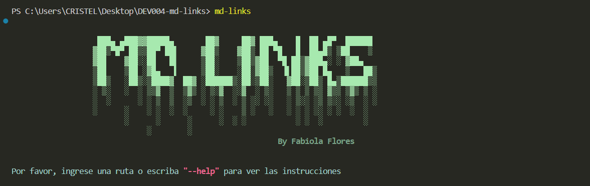
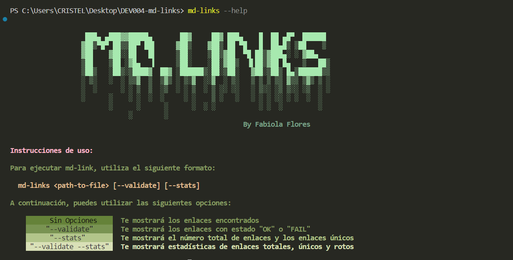
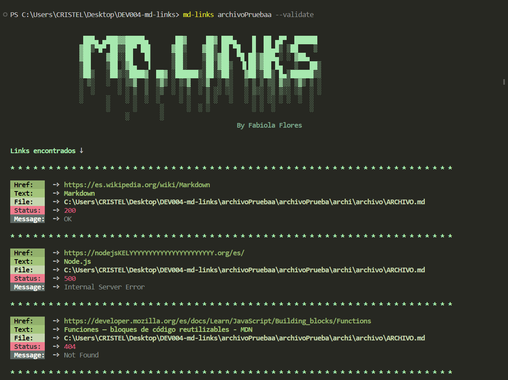
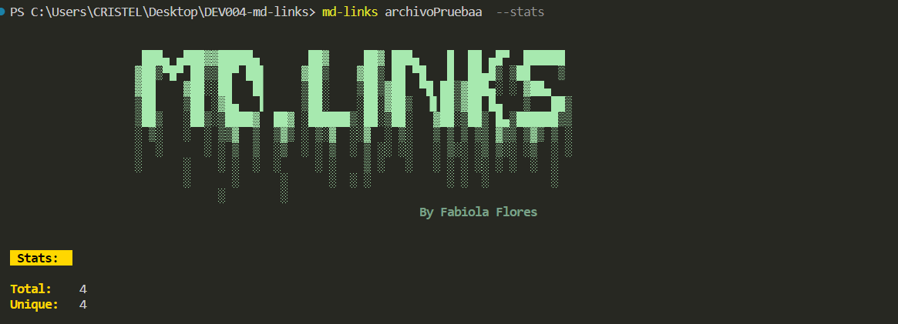
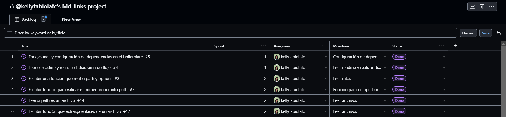
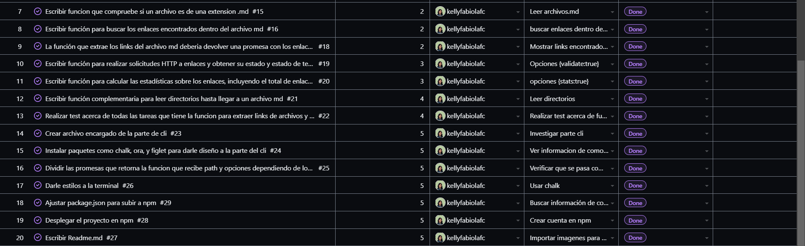
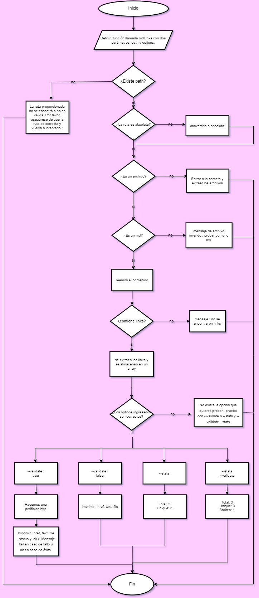
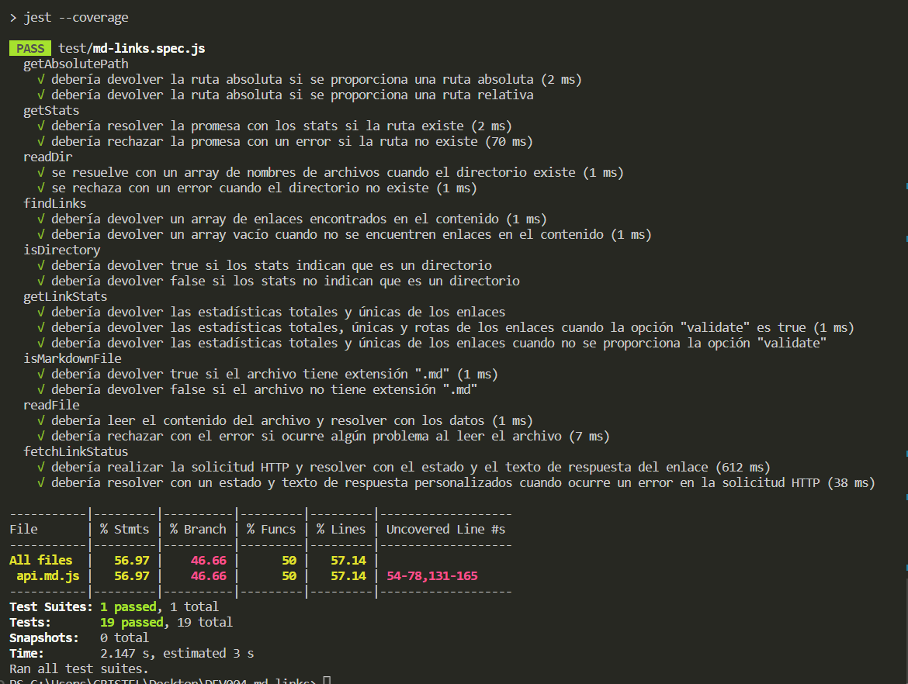

<p align="center" width="100%"> </p><br>

## Índice

* [1. Descripción](#1-descripción)
* [2. Instalación](#2-instalación)
* [3. Uso](#3-uso)
* [4. Planificación](#4-planificación)
* [5. Diagrama de flujo](#5-diagrama-de-flujo)
* [6. Pruebas unitarias ](#6-pruebas-unitarias)
* [7. Objetivos de aprendizaje](#7-objetivos-de-aprendizaje)
* [8. Archivos del proyecto ](#8-archivos-del-proyecto)
* [9. Este proyecto consta en dos partes ](#9-este-proyecto-consta-de-dos-partes)
* [10. Checklist](#10-checklist)


## 1. Descripción 

Md-links, tu aliado para el control de enlaces en archivos Markdown. Esta potente herramienta de línea de comandos (CLI) se encarga de analizar tus archivos Markdown en busca de enlaces, verificando su validez y brindándote datos relevantes. Con Md-links, puedes asegurarte de que todos tus enlaces estén activos y funcionales, evitando enlaces rotos y mejorando la calidad de tus documentos. Simplifica la gestión de enlaces Markdown y obtén estadísticas útiles para mantener tus proyectos siempre actualizados y profesionales.
## 2. Instalación
Antes de comenzar a utilizar Md-links, necesitarás instalarlo en tu entorno de desarrollo. Sigue los pasos a continuación para completar la instalación:

Abre tu terminal o línea de comandos.
Ejecuta el siguiente comando para instalar Md-links:
npm install kellyfabiolafc/DEV004-md-links
o
npm i fabiola-md.links

Una vez finalizada la instalación, estarás listo para utilizar Md-links y aprovechar todas sus funcionalidades para analizar y verificar los enlaces en tus archivos Markdown. ¡Comencemos!

## 3. Uso 
El comportamiento por defecto no debe validar si las URLs responden ok o no, solo debe identificar el archivo markdown (a partir de la ruta que recibe como argumento), analizar el archivo Markdown e imprimir los links que vaya encontrando, junto con la ruta del archivo donde aparece y el texto que hay dentro del link (truncado a 50 caracteres).
<p align="center" width="100%"> </p><br>

El mensaje de ayuda describe las instrucciones de uso de md-links y proporciona información sobre cómo ejecutarlo correctamente. Utiliza la librería chalk para imprimir texto en colores y estilos diferentes para resaltar la información clave.
<p align="center" width="100%"> </p><br>

Si pasamos la opción `--validate`, el módulo debe hacer una petición HTTP para averiguar si el link funciona o no. Si el link resulta en una redirección a una URL que responde ok, entonces consideraremos el link como ok.
<p align="center" width="100%"> </p><br>

Si pasamos la opción `--stats` el output (salida) será un texto con estadísticas básicas sobre los links.
<p align="center" width="100%"> </p><br>

También podemos combinar `--stats` y `--validate` para obtener estadísticas que necesiten de los resultados de la validación.
<p align="center" width="100%"> </p><br>

## 4. Planificación
<p align="center" width="100%"> </p>
<p align="center" width="100%"> </p>

## 5. Diagrama de flujo
<p align="center" width="100%"> </p>

## 6. Pruebas unitarias

<p align="center" width="100%"> </p><br>

## 7. Objetivos de aprendizaje

Reflexiona y luego marca los objetivos que has llegado a entender y aplicar en tu proyecto. Piensa en eso al decidir tu estrategia de trabajo.

### JavaScript

- [✔] **Diferenciar entre tipos de datos primitivos y no primitivos**

- [✔] **Arrays (arreglos)**

  <details><summary>Links</summary><p>

  * [Arreglos](https://curriculum.laboratoria.la/es/topics/javascript/04-arrays)
  * [Array - MDN](https://developer.mozilla.org/es/docs/Web/JavaScript/Reference/Global_Objects/Array/)
  * [Array.prototype.sort() - MDN](https://developer.mozilla.org/es/docs/Web/JavaScript/Reference/Global_Objects/Array/sort)
  * [Array.prototype.forEach() - MDN](https://developer.mozilla.org/es/docs/Web/JavaScript/Reference/Global_Objects/Array/forEach)
  * [Array.prototype.map() - MDN](https://developer.mozilla.org/es/docs/Web/JavaScript/Reference/Global_Objects/Array/map)
  * [Array.prototype.filter() - MDN](https://developer.mozilla.org/es/docs/Web/JavaScript/Reference/Global_Objects/Array/filter)
  * [Array.prototype.reduce() - MDN](https://developer.mozilla.org/es/docs/Web/JavaScript/Reference/Global_Objects/Array/Reduce)
</p></details>

- [✔] **Objetos (key, value)**

  <details><summary>Links</summary><p>

  * [Objetos en JavaScript](https://curriculum.laboratoria.la/es/topics/javascript/05-objects/01-objects)
</p></details>

- [✔] **Uso de condicionales (if-else, switch, operador ternario, lógica booleana)**

  <details><summary>Links</summary><p>

  * [Estructuras condicionales y repetitivas](https://curriculum.laboratoria.la/es/topics/javascript/02-flow-control/01-conditionals-and-loops)
  * [Tomando decisiones en tu código — condicionales - MDN](https://developer.mozilla.org/es/docs/Learn/JavaScript/Building_blocks/conditionals)
</p></details>

- [✔] **Funciones (params, args, return)**

  <details><summary>Links</summary><p>

  * [Funciones (control de flujo)](https://curriculum.laboratoria.la/es/topics/javascript/02-flow-control/03-functions)
  * [Funciones clásicas](https://curriculum.laboratoria.la/es/topics/javascript/03-functions/01-classic)
  * [Arrow Functions](https://curriculum.laboratoria.la/es/topics/javascript/03-functions/02-arrow)
  * [Funciones — bloques de código reutilizables - MDN](https://developer.mozilla.org/es/docs/Learn/JavaScript/Building_blocks/Functions)
</p></details>

- [✔] **Recursión o recursividad**

  <details><summary>Links</summary><p>

  * [Píldora recursión - YouTube Laboratoria Developers](https://www.youtube.com/watch?v=lPPgY3HLlhQ)
  * [Recursión o Recursividad - Laboratoria Developers en Medium](https://medium.com/laboratoria-developers/recursi%C3%B3n-o-recursividad-ec8f1a359727)
</p></details>

- [✔] **Módulos de CommonJS**

  <details><summary>Links</summary><p>

  * [Modules: CommonJS modules - Node.js Docs](https://nodejs.org/docs/latest/api/modules.html)
</p></details>

- [✔] **Diferenciar entre expresiones (expressions) y sentencias (statements)**

- [✔] **Callbacks**

  <details><summary>Links</summary><p>

  * [Función Callback - MDN](https://developer.mozilla.org/es/docs/Glossary/Callback_function)
</p></details>

- [✔] **Promesas**

  <details><summary>Links</summary><p>

  * [Promise - MDN](https://developer.mozilla.org/es/docs/Web/JavaScript/Reference/Global_Objects/Promise)
  * [How to Write a JavaScript Promise - freecodecamp (en inglés)](https://www.freecodecamp.org/news/how-to-write-a-javascript-promise-4ed8d44292b8/)
</p></details>

- [✔] **Pruebas unitarias (unit tests)**

  <details><summary>Links</summary><p>

  * [Empezando con Jest - Documentación oficial](https://jestjs.io/docs/es-ES/getting-started)
</p></details>

- [✔] **Pruebas asíncronas**

  <details><summary>Links</summary><p>

  * [Tests de código asincrónico con Jest - Documentación oficial](https://jestjs.io/docs/es-ES/asynchronous)
</p></details>

- [✔] **Uso de mocks y espías**

  <details><summary>Links</summary><p>

  * [Manual Mocks con Jest - Documentación oficial](https://jestjs.io/docs/es-ES/manual-mocks)
</p></details>

- [✔] **Pruebas de compatibilidad en múltiples entornos de ejecución**

- [✔] **Uso de linter (ESLINT)**

- [✔] **Uso de identificadores descriptivos (Nomenclatura y Semántica)**

### Node.js

- [✔] **Instalar y usar módulos con npm**

  <details><summary>Links</summary><p>

  * [Sitio oficial de npm (en inglés)](https://www.npmjs.com/)
</p></details>

- [✔] **Configuración de package.json**

  <details><summary>Links</summary><p>

  * [package.json - Documentación oficial (en inglés)](https://docs.npmjs.com/files/package.json)
</p></details>

- [✔] **Configuración de npm-scripts**

  <details><summary>Links</summary><p>

  * [scripts - Documentación oficial (en inglés)](https://docs.npmjs.com/misc/scripts)
</p></details>

- [✔] **process (env, argv, stdin-stdout-stderr, exit-code)**

  <details><summary>Links</summary><p>

  * [Process - Documentación oficial (en inglés)](https://nodejs.org/api/process.html)
</p></details>

- [✔] **File system (fs, path)**

  <details><summary>Links</summary><p>

  * [File system - Documentación oficial (en inglés)](https://nodejs.org/api/fs.html)
  * [Path - Documentación oficial (en inglés)](https://nodejs.org/api/path.html)
</p></details>

### Control de Versiones (Git y GitHub)

- [✔] **Git: Instalación y configuración**

- [✔] **Git: Control de versiones con git (init, clone, add, commit, status, push, pull, remote)**

- [✔] **Git: Integración de cambios entre ramas (branch, checkout, fetch, merge, reset, rebase, tag)**

- [✔] **GitHub: Creación de cuenta y repos, configuración de llaves SSH**

- [✔] **GitHub: Colaboración en Github (branches | forks | pull requests | code review | tags)**

- [✔] **GitHub: Organización en Github (projects | issues | labels | milestones | releases)**

### HTTP

- [✔] **Consulta o petición (request) y respuesta (response).**

  <details><summary>Links</summary><p>

  * [Generalidades del protocolo HTTP - MDN](https://developer.mozilla.org/es/docs/Web/HTTP/Overview)
  * [Mensajes HTTP - MDN](https://developer.mozilla.org/es/docs/Web/HTTP/Messages)
</p></details>

- [✔
] **Códigos de status de HTTP**

  <details><summary>Links</summary><p>

  * [Códigos de estado de respuesta HTTP - MDN](https://developer.mozilla.org/es/docs/Web/HTTP/Status)
  * [The Complete Guide to Status Codes for Meaningful ReST APIs - dev.to](https://dev.to/khaosdoctor/the-complete-guide-to-status-codes-for-meaningful-rest-apis-1-5c5)
</p></details>


## 8. Archivos del proyecto

* `README.md` con descripción del módulo, instrucciones de instalación/uso,
  documentación del API y ejemplos. Todo lo relevante para que cualquier
  developer que quiera usar tu librería pueda hacerlo sin inconvenientes.
* `index.js`: Desde este archivo debes exportar **una** función (`mdLinks`).
* `package.json` con nombre, versión, descripción, autores, licencia,
  dependencias, scripts (pretest, test, ...), main, bin
* `.editorconfig` con configuración para editores de texto. Este archivo no se
  debe cambiar.
* `.eslintrc` con configuración para linter. Este archivo contiene una
  configuración básica para ESLint, si deseas agregar reglas adicionales
  como Airbnb deberás modificar este archivo.
* `.gitignore` para ignorar `node_modules` u otras carpetas que no deban
  incluirse en control de versiones (`git`).
* `test/md-links.spec.js` debe contener los tests unitarios para la función
  `mdLinks()`. Tu inplementación debe pasar estos tets.

## 9. Este proyecto consta de DOS partes

### 1) JavaScript API

El módulo debe poder **importarse** en otros scripts de Node.js y debe ofrecer la
siguiente interfaz:

#### `mdLinks(path, options)`

##### Argumentos

* `path`: Ruta **absoluta** o **relativa** al **archivo** o **directorio**.
Si la ruta pasada es relativa, debe resolverse como relativa al directorio
desde donde se invoca node - _current working directory_).
* `options`: Un objeto con **únicamente** la siguiente propiedad:
  - `validate`: Booleano que determina si se desea validar los links
    encontrados.

##### Valor de retorno

La función debe **retornar una promesa** (`Promise`) que **resuelva a un arreglo**
(`Array`) de objetos (`Object`), donde cada objeto representa un link y contiene
las siguientes propiedades

Con `validate:false` :

* `href`: URL encontrada.
* `text`: Texto que aparecía dentro del link (`<a>`).
* `file`: Ruta del archivo donde se encontró el link.

Con `validate:true` :

* `href`: URL encontrada.
* `text`: Texto que aparecía dentro del link (`<a>`).
* `file`: Ruta del archivo donde se encontró el link.
* `status`: Código de respuesta HTTP.
* `ok`: Mensaje `fail` en caso de fallo u `ok` en caso de éxito.

#### Ejemplo (resultados como comentarios)

```js
const mdLinks = require("md-links");

mdLinks("./some/example.md")
  .then(links => {
    // => [{ href, text, file }, ...]
  })
  .catch(console.error);

mdLinks("./some/example.md", { validate: true })
  .then(links => {
    // => [{ href, text, file, status, ok }, ...]
  })
  .catch(console.error);

mdLinks("./some/dir")
  .then(links => {
    // => [{ href, text, file }, ...]
  })
  .catch(console.error);
```

### 2) CLI (Command Line Interface - Interfaz de Línea de Comando)

El ejecutable de nuestra aplicación debe poder ejecutarse de la siguiente
manera a través de la **terminal**:

`md-links <path-to-file> [options]`

Por ejemplo:

```sh
$ md-links ./some/example.md
./some/example.md http://algo.com/2/3/ Link a algo
./some/example.md https://otra-cosa.net/algun-doc.html algún doc
./some/example.md http://google.com/ Google
```

El comportamiento por defecto no debe validar si las URLs responden ok o no,
solo debe identificar el archivo markdown (a partir de la ruta que recibe como
argumento), analizar el archivo Markdown e imprimir los links que vaya
encontrando, junto con la ruta del archivo donde aparece y el texto
que hay dentro del link (truncado a 50 caracteres).

#### Options

##### `--validate`

Si pasamos la opción `--validate`, el módulo debe hacer una petición HTTP para
averiguar si el link funciona o no. Si el link resulta en una redirección a una
URL que responde ok, entonces consideraremos el link como ok.

Por ejemplo:

```sh
$ md-links ./some/example.md --validate
./some/example.md http://algo.com/2/3/ ok 200 Link a algo
./some/example.md https://otra-cosa.net/algun-doc.html fail 404 algún doc
./some/example.md http://google.com/ ok 301 Google
```

Vemos que el _output_ en este caso incluye la palabra `ok` o `fail` después de
la URL, así como el status de la respuesta recibida a la petición HTTP a dicha
URL.

##### `--stats`

Si pasamos la opción `--stats` el output (salida) será un texto con estadísticas
básicas sobre los links.

```sh
$ md-links ./some/example.md --stats
Total: 3
Unique: 3
```

También podemos combinar `--stats` y `--validate` para obtener estadísticas que
necesiten de los resultados de la validación.

```sh
$ md-links ./some/example.md --stats --validate
Total: 3
Unique: 3
Broken: 1
```


## 10. Checklist

### General

* [✔] Puede instalarse via `npm install --global <github-user>/md-links`

### `README.md`

* [✔] Un board con el backlog para la implementación de la librería.
* [✔] Documentación técnica de la librería.
* [✔] Guía de uso e instalación de la librería

### API `mdLinks(path, opts)`

* [✔] El módulo exporta una función con la interfaz (API) esperada.
* [✔] Implementa soporte para archivo individual
* [✔] Implementa soporte para directorios
* [✔] Implementa `options.validate`

### CLI

* [✔] Expone ejecutable `md-links` en el path (configurado en `package.json`)
* [✔] Se ejecuta sin errores / output esperado
* [✔] Implementa `--validate`
* [✔] Implementa `--stats`

### Pruebas / tests

* [ ] Pruebas unitarias cubren un mínimo del 70% de statements, functions,
  lines, y branches.
* [✔] Pasa tests (y linters) (`npm test`).

